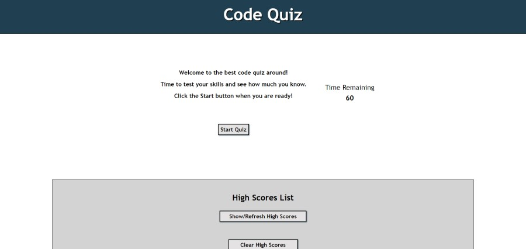

# Code Quiz

Week 4 Homework

## Description

Create a code quiz. The quiz includes a start button and then moves through a series of questions for the user to answer. If the user answers correct it should add to the score. It needs to have a countdown timer which offers a penalty if a question is aswered wrong. Additionally, the user needs to be able to enter their initials and save to high scores. Saved high scores should be visible in a list and clearing high scores sould be available. 

## Languages
- HTML
- CSS
- JS
- Jquery

## Link to GitHub main project page

[Project Page on GitHub](https://github.com/m-sherrill/code-quiz)

## Link to Deployed Application

[Live Depoyment Link](https://m-sherrill.github.io/code-quiz/)

## Screenshots of Finished Product

### Application before Password

## Contact Information

Github: [@m-sherrill](https://github.com/m-sherrill)

Email: mo.sherrill@outlook.com